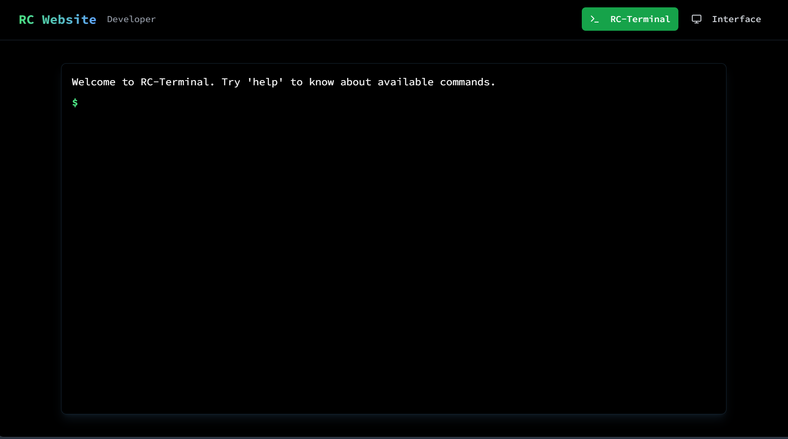
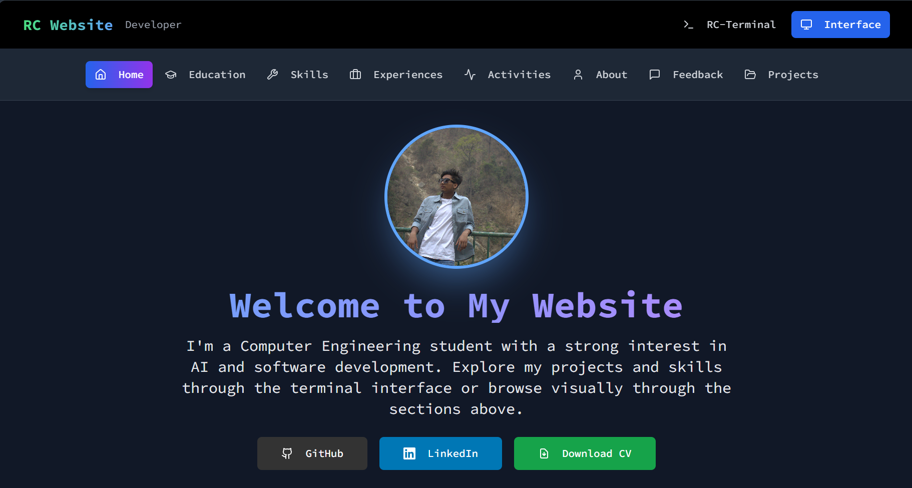

# RC-Terminal Portfolio

**[Link](https://www.ramanchaudhary.com.np)**

A modern, interactive terminal-style portfolio website built with Next.js, featuring both terminal and visual interface modes.

## 🚀 Features

### Dual Interface Modes
- **Terminal Mode**: Interactive command-line interface with real terminal experience
- **Interface Mode**: Modern web UI with dark theme and responsive design
- Seamless switching between modes with persistent state

## Terminal

### Terminal Features
- Real-time command execution with typing effects
- Command history and autocompletion
- Variable assignment and data manipulation
- Print functionality for generating PDFs
- Session-based state persistence

## Interface

### Interface Features
- Responsive gallery with keyboard navigation
- Interactive feedback form
- Mobile-optimized layout (2 images per row on mobile)
- Dark theme with professional styling

## 🛠️ Tech Stack

- **Framework**: Next.js 14 with TypeScript
- **Styling**: Tailwind CSS with custom dark theme
- **UI Components**: Custom components with shadcn/ui
- **State Management**: React hooks with session storage
- **Icons**: Lucide React

---

**Built with ❤️ by Raman**
[GitHub](https://github.com/RmnRj) | [LinkedIn](https://linkedin.com/in/rmnrj)
