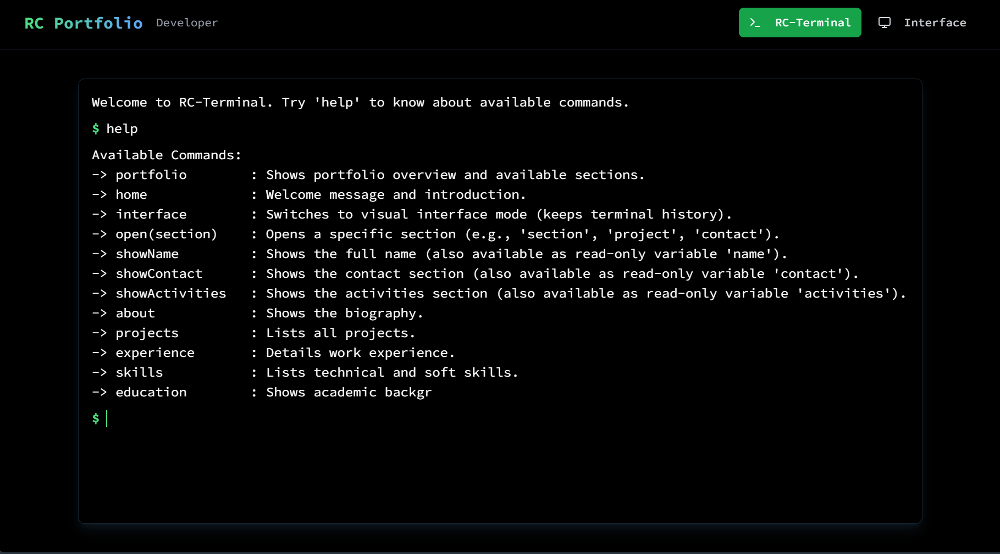

# RC-Terminal Documentation

A powerful portfolio terminal application built with React, Next.js, and TypeScript. This document covers all commands, architecture, default variables, and how the system works.


### Some commands


---

## Table of Contents

1. [Command Types](#command-types)
2. [Architecture Overview](#architecture-overview)
3. [Default Variables](#default-variables)
4. [How It Works](#how-it-works)
5. [Advanced Features](#advanced-features)

---

## Command Types

### 1. Navigation & Help Commands

| Command | Syntax | Description |
|---------|--------|-------------|
| `help` | `help` | Displays all available commands and usage examples. |
| `home` | `home` | Shows welcome message and introduction to the portfolio. |
| `portfolio` | `portfolio` | Displays portfolio overview and available sections. |
| `interface` | `interface` | Switches to visual interface mode while preserving terminal history. |

### 2. Portfolio Section Commands

These commands display content from different portfolio sections:

| Command | Syntax | Description |
|---------|--------|-------------|
| `about` | `about` | Shows biography/about me section. |
| `projects` | `projects` | Lists all projects with details. |
| `experience` | `experience` | Details work experience and career history. |
| `skills` | `skills` | Lists technical and soft skills. |
| `education` | `education` | Shows academic background and qualifications. |

### 3. Show Commands (Default Variables)

These commands display the same content as default variables but also work as commands:

| Command | Syntax | Default Variable | Description |
|---------|--------|------------------|-------------|
| `showName` | `showName` | `name` | Shows full name (read-only default variable). |
| `showContact` | `showContact` | `contact` | Shows contact information (read-only default variable). |
| `showActivities` | `showActivities` | `activities` | Shows activities/volunteering (read-only default variable). |

### 4. Variable Assignment & Storage

Store section content in custom variables for reuse:

```
varName -> section1 + section2 + section3
```

**Examples:**
- `v1 -> skills + projects` — Combines skills and projects into variable `v1`.
- `resume -> name + education + experience + skills` — Creates a complete resume variable.
- `contact_info -> contact + showactivities` — Stores contact and activities in one variable.

**Rules:**
- Variable names must start with a letter or underscore.
- Can combine multiple sections using `+` operator.
- Sections can be any portfolio section or another variable.
- Suggestions appear while typing: complete a section name to see `+` suggested for the next section.

### 5. Print & Display Commands

#### `print()`
Display sections or variables directly in the terminal with formatting.

```
print(skills, education)
print(v1)
print(all)
```

**Special Values:**
- `all` — Prints: name, contact, education, skills, experience, projects (in order).
- Variables (e.g., `v1`, `resume`) — Prints the combined content stored in that variable.
- Portfolio sections (e.g., `skills`, `projects`, `education`) — Prints the section directly.
- Default variables (e.g., `name`, `contact`, `activities`) — Prints the read-only default variable.

**Null Variable Behavior:**
If a variable was cleared with `clear(varName)`, attempting `print(varName)` shows "null variable" instead of an error.

#### `printcopy()`
Opens the browser print dialog for PDF export with Times New Roman font, 0.5" margins, header with name and date.

```
printcopy(skills, projects)
printcopy(v1)
printcopy(all)
```

Supports the same arguments as `print()`.

### 6. History & Terminal Commands

| Command | Syntax | Description |
|---------|--------|-------------|
| `history` | `history` | Displays all executed commands with status markers (🗸 = success, ✕ = error). |
| `clear()` or `clear` | `clear` | Clears only the terminal screen (preserves history). |
| `clear(history)` | `clear(history)` | Clears stored command history. |
| `clear(varName)` | `clear(v1)` | Clears a custom variable (cannot clear default variables). |
| `clear(history, v1)` | `clear(history, v1)` | Clears both history and a variable in one command. |

**Protection:**
- Default variables (`name`, `contact`, `activities`) cannot be cleared or deleted.
- Attempting to clear a default variable returns an error.

### 7. Contact & Download Commands

| Command | Syntax | Description |
|---------|--------|-------------|
| `feedback` | `feedback` | Opens default email client for feedback. |
| `feedback -m "msg"` | `feedback -m "Your message"` | Opens email with pre-filled message. |
| `open(github)` | `open(contact_key)` | Opens a contact link (e.g., github, linkedin, email). |
| `open(project_name)` | `open(Hosteler)` | Opens a project link on GitHub. |
| `downloadCV` | `downloadCV` | Downloads CV/Resume as PDF. |

---

## Architecture Overview

### File Structure

```
src/
├── lib/
│   ├── command-handler.tsx    # Core command parsing and execution logic
│   ├── content.ts              # Portfolio content and help text
│   ├── utils.ts                # Utility functions (CV download, etc.)
│   └── utils.ts                # Export utils
├── hooks/
│   ├── useTerminal.ts          # Terminal state management and input handling
│   └── use-mobile.tsx          # Mobile detection hook
├── components/
│   ├── Terminal.tsx            # Main terminal UI component
│   ├── Navigation.tsx          # Top navbar
│   ├── InterfaceView.tsx       # Visual interface mode
│   └── ui/                     # Reusable UI components
├── data/
│   ├── profile.json            # Profile and name data
│   ├── projects.json           # Projects data
│   ├── experience.json         # Experience/jobs data
│   ├── skills.json             # Skills data
│   ├── education.json          # Education data
│   ├── activities.json         # Activities/volunteering data
│   ├── contact.json            # Contact information
│   └── feedback.json           # Feedback submissions
└── app/
    ├── page.tsx                # Main page with terminal
    ├── layout.tsx              # Root layout
    ├── actions.ts              # Server actions (if any)
    └── globals.css             # Global styles
```

### Component Flow

```
┌─────────────────────────────────────────┐
│         Next.js App (page.tsx)          │
│     ├─ Navigation (Navbar)              │
│     └─ Terminal or InterfaceView        │
└────────────┬────────────────────────────┘
             │
             ├─ useTerminal Hook
             │  ├─ State: lines, input, suggestion, variables, commandHistory
             │  ├─ Handlers: handleKeyDown, handleInputChange, processCommand
             │  └─ Side Effects: sessionStorage persistence, auto-scroll
             │
             └─ handleCommand (command-handler.tsx)
                ├─ Parse input (regex matching)
                ├─ Execute command
                ├─ Return Line[] with type (output/error/success/input)
                └─ Update variables via setVariables
```

### Data Flow

1. **User Input** → `handleInputChange` → `getSuggestions()` → Display ghost text
2. **Enter Key** → `processCommand()` → `handleCommand()` → Execute
3. **Command Execution** → `setLines()` → Display output with typing animation
4. **Variables Updated** → `setVariables()` → Persist to component state
5. **History Recorded** → `addToHistory()` → Save to localStorage + component state

---

## Default Variables

Default variables are **read-only** and **protected** from being deleted, cleared, or reassigned. They are used primarily in `print()`, `printcopy()`, and variable assignment operations.

### 1. Single-Section Defaults

| Variable | Content | Source | Accessible |
|----------|---------|--------|------------|
| `name` | Full name | `profile.fullName` | `print()`, `printcopy()`, variable assignment |
| `contact` | Contact info (phone, email, github, linkedin, facebook) | `content.contact` | `print()`, `printcopy()`, variable assignment |
| `activities` | Activities/volunteering information | `content.activities` | `print()`, `printcopy()`, variable assignment |

**Example Usage:**
```
print(name, contact)
v1 -> name + skills + education
printcopy(contact)
```

### 2. Multi-Section Default: `all`

The special `all` variable automatically includes multiple sections in predefined order:

**Sections Included (in order):**
1. name
2. contact
3. education
4. skills
5. experience
6. projects

**Usage:**
```
print(all)              # Prints all 6 sections in order
printcopy(all)          # Opens print dialog with all sections
v1 -> all              # ❌ Cannot assign; 'all' is reserved
clear(all)             # ❌ Cannot clear; protected default
```

**Note:** `all` is **NOT** suggested as a command and is only for use within `print()` and `printcopy()`.

### 3. Null Variable Behavior

If a variable is cleared with `clear(varName)`, it becomes a "null variable". Attempting to print it shows:

```
$ clear(v1)
Cleared variable: v1.

$ print(v1)
--- V1 ---
null variable
```

This prevents errors and maintains a consistent experience.

---

## How It Works

### 1. Command Parsing Pipeline

```
User Input: "v1 -> skills + projects"
                    ↓
            Regex Matching
                    ↓
        Detect: Variable Assignment
                    ↓
        Split by: "->" and "+"
                    ↓
        Validate:
        ├─ Variable name (alphanumeric + underscore)
        ├─ Reserved words (cannot overwrite)
        └─ Section existence
                    ↓
        Execute: Combine sections → Store in variables
                    ↓
        Return: Success or error Line[]
```

### 2. Suggestion System

Suggestions update in real-time as the user types. The `getSuggestions()` function detects:

- **Command names** → Suggest matching command
- **Command arguments inside `()`** → Suggest matching sections/variables
- **Variable assignment `->` RHS** → Suggest sections + variables
- **After exact match** → Suggest separator (`+` for assignment, `,` for commands)

**Example Flow:**
```
$ var1 -> na
          ↑ Detect "na"
          ↓ Suggest "me" → "name"
$ var1 -> name
                ↑ Completed "name"
                ↓ Suggest " + "
$ var1 -> name +
                  ↑ Suggest first available section
                  ↓ Suggest "contact"
$ var1 -> name + contact
                         ↑ Completed "contact"
                         ↓ Suggest " + "
```

### 3. Terminal History & Persistence

**Storage Layers:**

1. **Component State** (`commandHistory` in useTerminal)
   - Fast, in-memory access
   - Lost on page refresh
   
2. **localStorage** (persistent across sessions)
   - Key: `"commandHistory"`
   - Value: JSON array of `{ command: string, status: 'success' | 'error' }`
   - Survives page refresh

**History Format:**
```json
[
  { "command": "help", "status": "success" },
  { "command": "var1 -> skills", "status": "success" },
  { "command": "print(var1)", "status": "success" },
  { "command": "unknown_cmd", "status": "error" }
]
```

**Display:**
```
$ history
🗸 help
🗸 var1 -> skills
🗸 print(var1)
✕ unknown_cmd
```

### 4. Print & Printcopy Rendering

#### `print()` Flow:

```
User: "print(skills, name)"
           ↓
    Resolve each argument:
    ├─ "skills" → formatOutput("Skills", content.skills)
    ├─ "name" → formatOutput("Name", content.profile.fullName)
           ↓
    Format as terminal lines:
    --- SKILLS ---
    Category: Skill1, Skill2
    
    --- NAME ---
    Full Name
           ↓
    Display in terminal with line-by-line typing animation
```

#### `printcopy()` Flow:

```
User: "printcopy(all)"
           ↓
    Resolve "all" → [name, contact, education, skills, experience, projects]
           ↓
    Build HTML with styling:
    ├─ Font: Times New Roman, 11pt
    ├─ Margins: 0.5"
    ├─ Header: Name + Date
    ├─ Sections: Formatted content
           ↓
    Append to DOM (hidden)
           ↓
    Call window.print()
           ↓
    Remove from DOM
```

### 5. Text Selection & Focus Management

**Real Terminal Behavior:**
- User can select text anywhere in the terminal
- Typing only works in the **current (last) command line**
- Clicking above the input line: focus returns to input without auto-clearing selection
- No focus stealing during active text selection

**Implementation:**
- `handleTerminalMouseUp()` checks for active selection
- If no selection, focuses input automatically
- Selection preserved across interactions

### 6. Typing Animation

**Speed:** ~5000 characters per second (0.0001ms per character)

**Process:**
```
For each output line:
├─ Create placeholder Line with empty content
├─ Add to lines array
│
└─ For each character in text:
   ├─ Wait 0.0001ms
   ├─ Update line with text.slice(0, charIndex)
   └─ Re-render
```

Provides smooth, organic character-by-character reveal effect.

---

## Advanced Features

### 1. Reserved Variable Names

These names cannot be used as custom variables:

- All command names (help, home, portfolio, interface, etc.)
- All section names (skills, education, projects, etc.)
- All show commands (showName, showContact, showActivities)
- Default variables (name, contact, activities, all)
- Common aliases (showname, showcontact, showactivities)

### 2. Case-Insensitive Command Parsing

Commands are case-insensitive for user convenience:

```
HELP = help = Help = hElP ✅
Skills = SKILLS = skills ✅
v1 -> NAME + CONTACT ✅ (sections are case-insensitive)
```

Variable names and aliases are normalized to lowercase for comparison.

### 3. Multi-Argument Print

```
print(skills, education, projects)   # Multiple args
print(v1, v2, v3)                    # Multiple variables
print(name, contact, skills, v1)     # Mixed sections & variables
printcopy(all, v1)                   # all + custom variable
```

Sections are separated by blank lines for readability.

### 4. Keyboard Shortcuts

| Key | Action |
|-----|--------|
| `Enter` | Execute current command |
| `ArrowUp` | Navigate to previous command in history |
| `ArrowDown` | Navigate to next command in history |
| `Tab` | Accept suggestion (auto-complete) |
| `Ctrl+A` | Select all text in input |
| `Ctrl+C` | (OS-level) Copy selected text |

### 5. Session Persistence

**Terminal Content:** Saved to `sessionStorage` under key `'terminalLines'`
- Preserves printed output if user navigates away
- Clears when browser session ends

**Command History:** Saved to `localStorage` under key `'commandHistory'`
- Persists across browser sessions
- Cleared only with explicit `clear(history)` command

**Variables:** Stored in component state only
- Lost on page refresh
- Can be saved to a variable before refreshing

### 6. Error Handling

**Command Not Found:**
```
$ unknown_cmd
Error: command not found: unknown_cmd. Try 'help'.
```

**Invalid Syntax:**
```
$ var1 -> 
Error: Invalid variable assignment syntax. Use: varName -> section1 + section2
```

**Variable Name Conflict:**
```
$ help -> skills
Error: Cannot use reserved name 'help' as a variable.
```

**Missing Section:**
```
$ print(nonexistent)
Error: Cannot print content from 'nonexistent'.
```

**Protected Default:**
```
$ clear(name)
Error: Cannot clear default variable: name.
```

---

## Quick Reference

### Most Common Commands

```
help                    # See all commands
skills                  # View skills
projects                # View projects
v1 -> skills + projects # Save to variable
print(v1)               # Display variable
printcopy(v1)           # Print to PDF
history                 # See command history
clear                   # Clear screen
clear(v1)               # Delete variable
interface               # Switch to visual mode
```

### Advanced Workflows

**Create a Complete Resume:**
```
resume -> name + contact + education + experience + skills
printcopy(resume)
```

**Combine Multiple Sections:**
```
cv -> all
print(cv)
```

**Clear & Start Fresh:**
```
clear(history)
clear(v1, v2, v3)
clear
```

---

## Summary

RC-Terminal is a **command-driven portfolio interface** with a modern terminal aesthetic. It combines the power of JavaScript/TypeScript with portfolio data, enabling:

- ✅ Rich text rendering with sections and variables
- ✅ Command history tracking with status markers
- ✅ Smart variable assignment and reuse
- ✅ Professional PDF export with formatting
- ✅ Real-time suggestions and auto-complete
- ✅ Protected default variables for data integrity
- ✅ Session persistence across reloads
- ✅ Keyboard navigation and shortcuts

Perfect for showcasing a developer portfolio in an interactive, engaging way!
